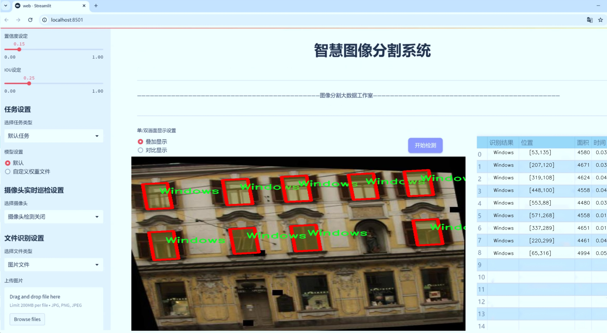
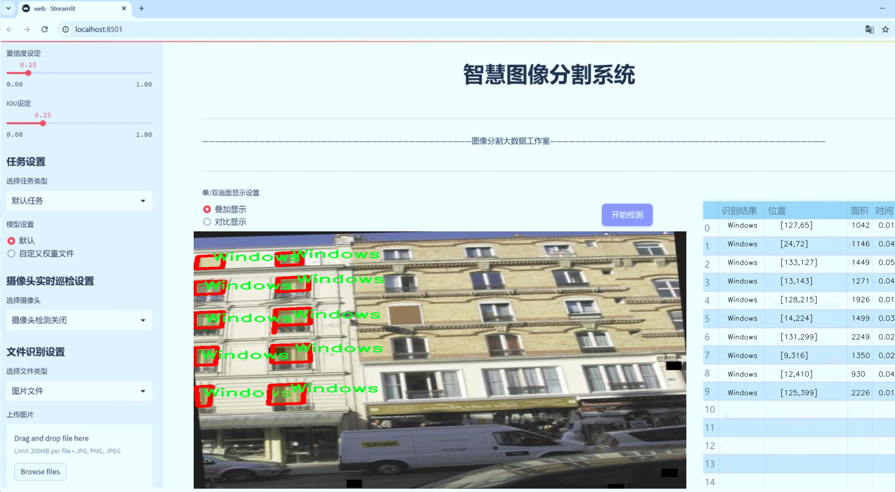
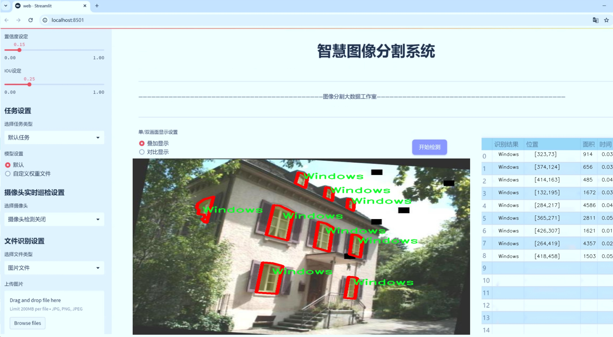
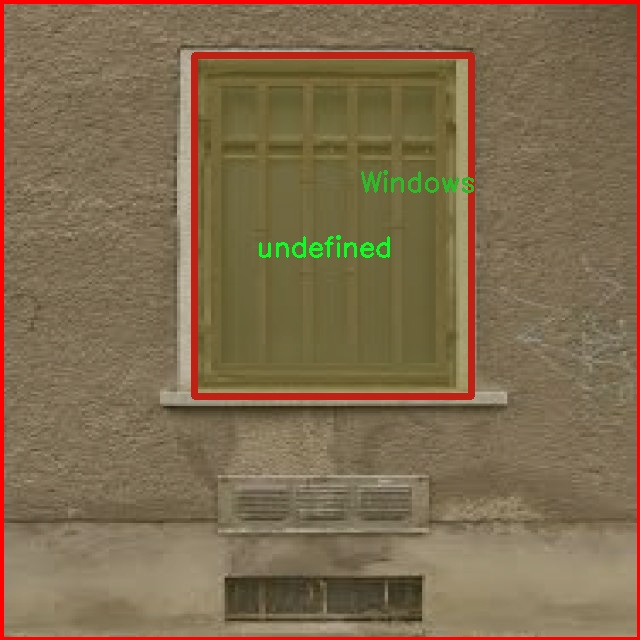
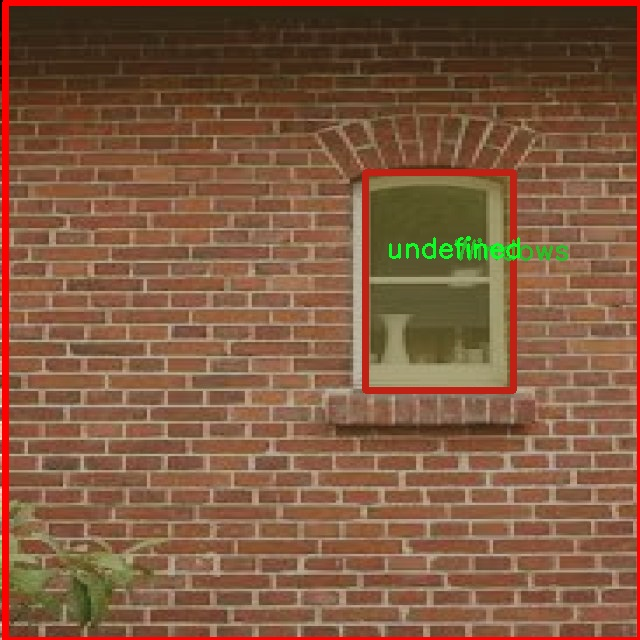
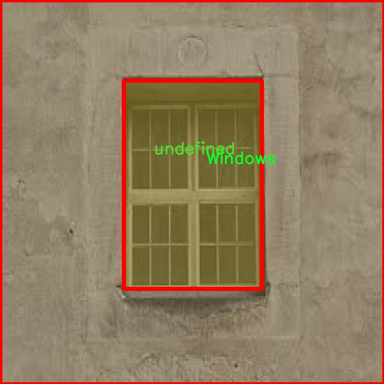
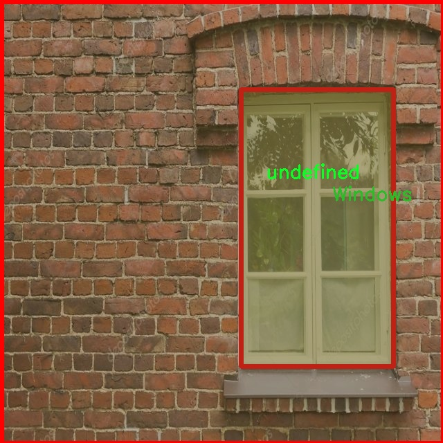
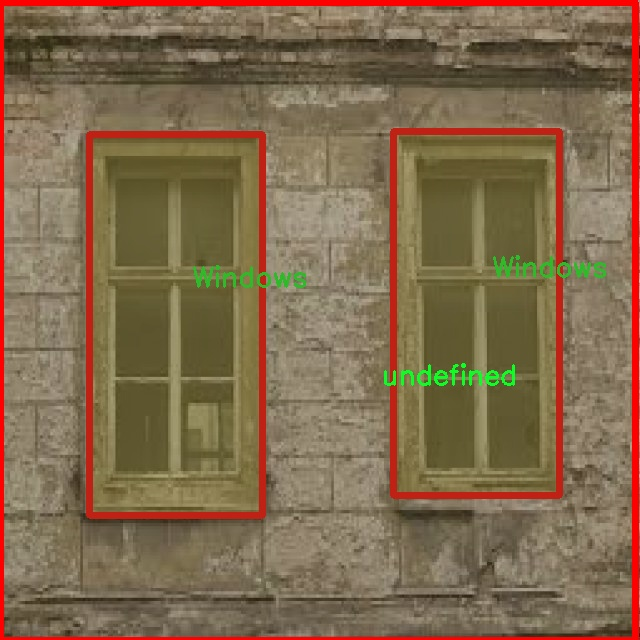

# 建筑窗户分割系统源码＆数据集分享
 [yolov8-seg-convnextv2＆yolov8-seg-C2f-EMSC等50+全套改进创新点发刊_一键训练教程_Web前端展示]

### 1.研究背景与意义

项目参考[ILSVRC ImageNet Large Scale Visual Recognition Challenge](https://gitee.com/YOLOv8_YOLOv11_Segmentation_Studio/projects)

项目来源[AAAI Global Al lnnovation Contest](https://kdocs.cn/l/cszuIiCKVNis)

研究背景与意义

随着城市化进程的加快，建筑物的数量和复杂性不断增加，建筑窗户作为建筑外立面的重要组成部分，其数量、形状和分布对建筑的美观性、能效和安全性均有显著影响。因此，准确地识别和分割建筑窗户，不仅有助于建筑设计与改造，也为城市规划、建筑维护和智能监控等领域提供了重要的数据支持。传统的建筑窗户识别方法往往依赖于人工标注和经验判断，效率低下且容易受到人为因素的影响。近年来，深度学习技术的快速发展为建筑窗户的自动化识别与分割提供了新的解决方案，其中YOLO（You Only Look Once）系列模型因其高效性和准确性受到广泛关注。

YOLOv8作为YOLO系列的最新版本，具备了更强的特征提取能力和更快的推理速度，适合于实时应用场景。然而，针对建筑窗户的分割任务，YOLOv8仍存在一定的局限性，尤其是在复杂背景和不同光照条件下的窗户识别精度。因此，基于YOLOv8的改进模型，专门针对建筑窗户的分割任务进行研究，具有重要的理论和实际意义。

本研究所使用的数据集包含2900张图像，涵盖了四个类别：楼层、窗户、未定义和窗户。这一数据集的构建为模型的训练和验证提供了丰富的样本，能够有效提升模型的泛化能力和鲁棒性。通过对数据集的深入分析，可以发现窗户在建筑图像中的多样性和复杂性，这为模型的设计和优化提出了更高的要求。因此，改进YOLOv8以适应这一特定任务，将有助于提高建筑窗户的分割精度，进而推动相关领域的研究与应用。

此外，建筑窗户的自动化分割系统不仅能够提升建筑设计的效率，还能在建筑能效分析、维护管理和安全监控等方面发挥重要作用。例如，在建筑能效分析中，准确的窗户分割可以帮助评估窗户的热性能，进而优化建筑的能源使用。在维护管理中，自动化的窗户识别与分割系统可以实现对建筑物状态的实时监控，及时发现潜在的安全隐患。而在安全监控中，精确的窗户分割能够辅助安防系统对异常行为进行识别和报警。

综上所述，基于改进YOLOv8的建筑窗户分割系统的研究，不仅具有重要的学术价值，也具备广泛的应用前景。通过对建筑窗户的精准识别与分割，能够为建筑行业的数字化转型提供有力支持，推动智能建筑和智慧城市的发展。因此，本研究将为相关领域的研究者和从业者提供新的思路和方法，促进建筑智能化的进程。

### 2.图片演示







##### 注意：由于此博客编辑较早，上面“2.图片演示”和“3.视频演示”展示的系统图片或者视频可能为老版本，新版本在老版本的基础上升级如下：（实际效果以升级的新版本为准）

  （1）适配了YOLOV8的“目标检测”模型和“实例分割”模型，通过加载相应的权重（.pt）文件即可自适应加载模型。

  （2）支持“图片识别”、“视频识别”、“摄像头实时识别”三种识别模式。

  （3）支持“图片识别”、“视频识别”、“摄像头实时识别”三种识别结果保存导出，解决手动导出（容易卡顿出现爆内存）存在的问题，识别完自动保存结果并导出到tempDir中。

  （4）支持Web前端系统中的标题、背景图等自定义修改，后面提供修改教程。

  另外本项目提供训练的数据集和训练教程,暂不提供权重文件（best.pt）,需要您按照教程进行训练后实现图片演示和Web前端界面演示的效果。

### 3.视频演示

[3.1 视频演示](https://www.bilibili.com/video/BV1yCy7YkEQL/)

### 4.数据集信息展示

##### 4.1 本项目数据集详细数据（类别数＆类别名）

nc: 4
names: ['Floor', 'Windows', 'undefined', 'windows']


##### 4.2 本项目数据集信息介绍

数据集信息展示

在本研究中，我们采用了名为“Window detect in a building”的数据集，以训练和改进YOLOv8-seg模型在建筑窗户分割任务中的表现。该数据集专门设计用于提升计算机视觉系统在建筑物窗户检测和分割方面的能力，尤其是在复杂的建筑环境中。数据集包含了多种不同的建筑窗户样本，旨在为模型提供丰富的训练数据，以便其能够准确识别和分割建筑物中的窗户。

该数据集的类别数量为四个，具体类别包括“Floor”、“Windows”、“undefined”和“windows”。每个类别都代表了建筑物中不同的视觉元素，帮助模型学习如何在多样化的场景中进行准确的分割。首先，“Floor”类别包含了建筑物的地面部分，这一类别的样本有助于模型理解建筑物的整体结构和空间布局。其次，“Windows”类别和“windows”类别虽然名称相似，但可能代表了不同类型或不同状态的窗户，提供了多样化的窗户样本以增强模型的泛化能力。最后，“undefined”类别则可能包含了那些无法明确归类的区域或元素，这一类别的存在有助于模型在面对复杂场景时保持鲁棒性。

数据集的构建过程中，研究团队精心挑选了多种建筑风格和不同环境下的窗户图像，确保数据的多样性和代表性。这些图像不仅涵盖了不同的建筑类型，如住宅、商业楼宇和公共设施，还考虑了不同的拍摄角度、光照条件和天气状况。这种多样性使得模型在训练过程中能够学习到更广泛的特征，从而在实际应用中表现出更高的准确性和可靠性。

此外，数据集中的每一张图像都经过了精确的标注，确保每个类别的区域都被准确地划分。这种高质量的标注对于训练深度学习模型至关重要，因为它直接影响到模型的学习效果和最终的分割性能。通过使用该数据集，YOLOv8-seg模型能够在训练过程中不断优化其参数，以便在面对真实世界中的建筑窗户时，能够快速而准确地进行分割。

在数据集的使用过程中，我们还将进行一系列的数据增强操作，以进一步提升模型的鲁棒性和泛化能力。这些操作包括随机裁剪、旋转、缩放以及颜色变换等，旨在模拟不同的环境变化，使得模型在实际应用中能够适应各种条件。

综上所述，“Window detect in a building”数据集为本研究提供了一个强大的基础，助力于YOLOv8-seg模型在建筑窗户分割任务中的深入学习与优化。通过充分利用该数据集的多样性和高质量标注，我们期望能够显著提升模型的性能，为建筑物的智能监测和管理提供更为精准的技术支持。











### 5.全套项目环境部署视频教程（零基础手把手教学）

[5.1 环境部署教程链接（零基础手把手教学）](https://www.bilibili.com/video/BV1jG4Ve4E9t/?vd_source=bc9aec86d164b67a7004b996143742dc)


[5.2 安装Python虚拟环境创建和依赖库安装视频教程链接（零基础手把手教学）](https://www.bilibili.com/video/BV1nA4VeYEze/?vd_source=bc9aec86d164b67a7004b996143742dc)

### 6.手把手YOLOV8-seg训练视频教程（零基础小白有手就能学会）

[6.1 手把手YOLOV8-seg训练视频教程（零基础小白有手就能学会）](https://www.bilibili.com/video/BV1cA4VeYETe/?vd_source=bc9aec86d164b67a7004b996143742dc)


按照上面的训练视频教程链接加载项目提供的数据集，运行train.py即可开始训练



     Epoch   gpu_mem       box       obj       cls    labels  img_size
     1/200     0G   0.01576   0.01955  0.007536        22      1280: 100%|██████████| 849/849 [14:42<00:00,  1.04s/it]
               Class     Images     Labels          P          R     mAP@.5 mAP@.5:.95: 100%|██████████| 213/213 [01:14<00:00,  2.87it/s]
                 all       3395      17314      0.994      0.957      0.0957      0.0843

     Epoch   gpu_mem       box       obj       cls    labels  img_size
     2/200     0G   0.01578   0.01923  0.007006        22      1280: 100%|██████████| 849/849 [14:44<00:00,  1.04s/it]
               Class     Images     Labels          P          R     mAP@.5 mAP@.5:.95: 100%|██████████| 213/213 [01:12<00:00,  2.95it/s]
                 all       3395      17314      0.996      0.956      0.0957      0.0845

     Epoch   gpu_mem       box       obj       cls    labels  img_size
     3/200     0G   0.01561    0.0191  0.006895        27      1280: 100%|██████████| 849/849 [10:56<00:00,  1.29it/s]
               Class     Images     Labels          P          R     mAP@.5 mAP@.5:.95: 100%|███████   | 187/213 [00:52<00:00,  4.04it/s]
                 all       3395      17314      0.996      0.957      0.0957      0.0845


### 7.50+种全套YOLOV8-seg创新点代码加载调参视频教程（一键加载写好的改进模型的配置文件）

[7.1 50+种全套YOLOV8-seg创新点代码加载调参视频教程（一键加载写好的改进模型的配置文件）](https://www.bilibili.com/video/BV1Hw4VePEXv/?vd_source=bc9aec86d164b67a7004b996143742dc)

### 8.YOLOV8-seg图像分割算法原理

原始YOLOV8-seg算法原理

YOLOV8-seg算法是YOLO系列的最新进展，专注于目标检测与分割任务的高效实现。作为一种单阶段检测算法，YOLOV8-seg在精度和速度上都表现出色，尤其在复杂场景下的应用潜力巨大。该算法的核心架构由输入端、主干网络、特征融合网络和检测模块四个部分组成，旨在通过轻量化设计和创新模块的引入，提升模型的整体性能。

首先，YOLOV8-seg的输入端负责对输入图像进行预处理，包括调整图像比例、实现Mosaic增强等。这一过程不仅提高了模型对多样化输入的适应能力，还为后续的特征提取打下了良好的基础。YOLOV8-seg的主干网络采用了改进的DarkNet结构，结合了C2f模块的优势，取代了传统的C3模块。C2f模块的设计理念在于通过增加残差连接来丰富梯度信息的流动，确保在保持轻量化的同时，模型能够提取到更加丰富的特征。这种结构的创新使得YOLOV8-seg在处理不同尺度的目标时，能够更好地捕捉到细节信息，从而提升了检测精度。

在特征融合网络部分，YOLOV8-seg继续沿用PAN-FPN的结构，但对上采样部分的卷积结构进行了简化。这一改进不仅减少了计算复杂度，还加快了特征融合的速度。特征金字塔网络与路径聚合网络的结合，促进了语义特征与定位特征的有效转移，使得模型在面对不同尺度的目标时，能够保持良好的检测性能。此外，YOLOV8-seg还引入了BiFPN网络，通过高效的双向跨尺度连接和加权特征融合，进一步提升了模型对不同尺度特征信息的提取能力。这一系列的设计使得YOLOV8-seg在特征融合方面表现出色，能够更好地应对复杂的场景。

在检测模块中，YOLOV8-seg采用了解耦合头结构，将分类和回归任务分离开来。这一创新使得模型在训练和推理过程中能够更高效地处理目标检测任务，显著加快了模型的收敛速度。同时，YOLOV8-seg摒弃了传统的Anchor-Based方法，转而采用Anchor-Free的策略，这一变化不仅简化了模型的设计，还提高了对目标形状和尺度变化的适应能力。通过这种方式，YOLOV8-seg能够在多样化的应用场景中实现更为精准的目标检测与分割。

在损失函数的设计上，YOLOV8-seg使用了BCELoss作为分类损失，DFLLoss与CIoULoss作为回归损失。这种组合损失函数的设计旨在更好地平衡分类与回归任务的优化，使得模型在训练过程中能够更快地收敛到全局最优解。此外，YOLOV8-seg在训练过程中还采用了动态Task-Aligned Assigner样本分配策略，结合了数据增强技术，有效提升了模型的鲁棒性和泛化能力。

总的来说，YOLOV8-seg算法通过一系列创新设计和优化，成功地在目标检测与分割任务中实现了高效的性能提升。其轻量化的结构设计、灵活的特征融合策略以及高效的检测模块，使得YOLOV8-seg在实际应用中展现出强大的能力。无论是在智能监控、自动驾驶还是医学影像分析等领域，YOLOV8-seg都能够提供快速且准确的目标检测与分割解决方案，推动了计算机视觉技术的进一步发展。随着YOLOV8-seg的不断优化与迭代，未来在更复杂的应用场景中，其潜力将更加显著，成为推动智能化发展的重要工具。


### 9.系统功能展示（检测对象为举例，实际内容以本项目数据集为准）

图9.1.系统支持检测结果表格显示

  图9.2.系统支持置信度和IOU阈值手动调节

  图9.3.系统支持自定义加载权重文件best.pt(需要你通过步骤5中训练获得)

  图9.4.系统支持摄像头实时识别

  图9.5.系统支持图片识别

  图9.6.系统支持视频识别

  图9.7.系统支持识别结果文件自动保存

  图9.8.系统支持Excel导出检测结果数据


### 10.50+种全套YOLOV8-seg创新点原理讲解（非科班也可以轻松写刊发刊，V11版本正在科研待更新）

#### 10.1 由于篇幅限制，每个创新点的具体原理讲解就不一一展开，具体见下列网址中的创新点对应子项目的技术原理博客网址【Blog】：


[10.1 50+种全套YOLOV8-seg创新点原理讲解链接](https://gitee.com/qunmasj/good)

#### 10.2 部分改进模块原理讲解(完整的改进原理见上图和技术博客链接)【如果此小节的图加载失败可以通过CSDN或者Github搜索该博客的标题访问原始博客，原始博客图片显示正常】
### 可变性卷积DCN简介
卷积神经网络由于其构建模块中固定的几何结构，本质上受限于模型几何变换。为了提高卷积神经网络的转换建模能力，《Deformable Convolutional Networks》作者提出了两个模块：可变形卷积（deformable convolution）和可变形RoI池（deformable RoI pooling）。这两个模块均基于用额外的偏移来增加模块中的空间采样位置以及从目标任务中学习偏移的思想，而不需要额外的监督。

第一次证明了在深度神经网络中学习密集空间变换（dense spatial transformation）对于复杂的视觉任务是有效的

视觉识别中的一个关键挑战是如何适应对象比例、姿态、视点和零件变形中的几何变化或模型几何变换。一般有两种方法实现：
1）建立具有足够期望变化的训练数据集。这通常通过增加现有的数据样本来实现，例如通过仿射变换。但是训练成本昂贵而且模型参数庞大。
2）使用变换不变（transformation-invariant）的特征和算法。比如比较有名的SIFT(尺度不变特征变换)便是这一类的代表算法。

但以上的方法有两个缺点：
1）几何变换被假定为固定的和已知的，这些先验知识被用来扩充数据，设计特征和算法。为此，这个假设阻止了对具有未知几何变换的新任务的推广，从而导致这些几何变换可能没有被正确建模。
2）对于不变特征和算法进行手动设计，对于过于复杂的变换可能是困难的或不可行的。

卷积神经网络本质上局限于模拟大型未知转换。局限性源于CNN模块的固定几何结构：卷积单元在固定位置对输入特征图进行采样；池化层以固定比率降低特征矩阵分辨率；RoI（感兴趣区域）池化层将RoI分成固定的空间箱（spatial bins）等。缺乏处理几何变换的内部机制。

这种内部机制的缺乏会导致一些问题，举个例子。同一个CNN层中所有激活单元的感受野大小是相同的，但是这是不可取的。因为不同的位置可能对应于具有不同尺度或变形的对象，所以尺度或感受野大小的自适应确定对于具有精细定位的视觉识别是渴望的。

对于这些问题，作者提出了两个模块提高CNNs对几何变换建模的能力。


deformable convolution（可变形卷积）
将2D偏移量添加到标准卷积中的常规网格采样位置，使得采样网格能够自由变形。通过额外的卷积层，从前面的特征映射中学习偏移。因此，变形采用局部、密集和自适应的方式取决于输入特征。


deformable RoI pooling（可变形RoI池化）
为先前RoI池化的常规库（bin）分区中的每个库位置（bin partition）增加了一个偏移量。类似地，偏移是从前面的特征图和感兴趣区域中学习的，从而能够对具有不同形状的对象进行自适应部件定位（adaptive part localization）。

#### Deformable Convolutional Networks
Deformable Convolution
2D卷积由两个步骤组成：
1）在输入特征图x xx上使用规则网格R RR进行采样。
2）把这些采样点乘不同权重w ww后相加。

网格R定义感受野大小和扩张程度，比如内核大小为3x3，扩张程度为1的网格R可以表示为：
R = { ( − 1 , − 1 ) , ( − 1 , 0 ) , … , ( 0 , 1 ) , ( 1 , 1 ) } R = \{(-1,-1),(-1,0),\dots,(0,1),(1,1)\}
R={(−1,−1),(−1,0),…,(0,1),(1,1)}

​
 一般为小数，使用双线性插值进行处理。（把小数坐标分解到相邻的四个整数坐标点来计算结果）


具体操作如图所示：


首先对输入特征层进行一个普通的3x3卷积处理得到偏移域（offset field）。偏移域特征图具有与输入特征图相同的空间分辨率，channels维度2N对应于N个2D（xy两个方向）偏移。其中的N是原输入特征图上所具有的N个channels，也就是输入输出channels保持不变，这里xy两个channels分别对输出特征图上的一个channels进行偏移。确定采样点后就通过与相对应的权重w点乘相加得到输出特征图上该点最终值。

前面也提到过，由于这里xy两个方向所训练出来的偏移量一般来说是一个小数，那么为了得到这个点所对应的数值，会采用双线性插值的方法，从最近的四个邻近坐标点中计算得到该偏移点的数值，公式如下：


具体推理过程见：双线性插值原理

#### Deformable RoI Poolingb
所有基于区域提议（RPN）的对象检测方法都使用RoI池话处理，将任意大小的输入矩形区域转换为固定大小的特征图。


 一般为小数，需要使用双线性插值进行处理。


具体操作如图所示：


当时看这个部分的时候觉得有些突兀，明明RoI池化会将特征层转化为固定尺寸的区域。其实，我个人觉得，这个部分与上述的可变性卷积操作是类似的。这里同样是使用了一个普通的RoI池化操作，进行一些列处理后得到了一个偏移域特征图，然后重新作用于原来的w × H w \times Hw×H的RoI。只不过这里不再是规律的逐行逐列对每个格子进行池化，而是对于格子进行偏移后再池化处理。

#### Postion﹣Sensitive RoI Pooling
除此之外，论文还提出一种PS RoI池化（Postion﹣Sensitive RoI Pooling）。不同于上述可变形RoI池化中的全连接过程，这里使用全卷积替换。

具体操作如图所示：


首先，对于原来的特征图来说，原本是将输入特征图上的RoI区域分成k × k k\times kk×k个bin。而在这里，则是将输入特征图进行卷积操作，分别得到一个channels为k 2 ( C + 1 ) k^{2}(C+1)k (C+1)的得分图（score maps）和一个channels为2 k 2 ( C + 1 ) 2k{2}(C+1)2k 2 (C+1)的偏移域（offset fields），这两个特征矩阵的宽高是与输入特征矩阵相同的。其中，得分图的channels中，k × k k \times kk×k分别表示的是每一个网格，C CC表示的检测对象的类别数目，1表示背景。而在偏移域中的2表示xy两个方向的偏移。
也就是说，在PS RoI池化中，对于RoI的每一个网格都独自占一个通道形成一层得分图，然后其对于的偏移量占两个通道。offset fields得到的偏移是归一化后的偏移，需要通过和deformable RoI pooling中一样的变换方式得到∆ p i j ∆p_{ij}∆p ij，然后对每层得分图进行偏移池化处理。最后处理完的结果就对应着最后输出的一个网格。所以其包含了位置信息。

原文论述为：


#### Understanding Deformable ConvNets
当可变形卷积叠加时，复合变形的效果是深远的。如图所示：


ps：a是标准卷积的固定感受野，b是可变形卷积的适应性感受野。

感受野和标准卷积中的采样位置在整个顶部特征图上是固定的(左)。在可变形卷积中，它们根据对象的比例和形状进行自适应调整(右)。


### 11.项目核心源码讲解（再也不用担心看不懂代码逻辑）

#### 11.1 ultralytics\nn\backbone\SwinTransformer.py

以下是经过简化和注释的Swin Transformer代码，保留了最核心的部分，并对每个关键部分进行了详细的中文注释：

```python
import torch
import torch.nn as nn
import torch.nn.functional as F
import numpy as np
from timm.models.layers import DropPath, to_2tuple, trunc_normal_

class Mlp(nn.Module):
    """ 多层感知机（MLP）模块 """

    def __init__(self, in_features, hidden_features=None, out_features=None, act_layer=nn.GELU, drop=0.):
        super().__init__()
        out_features = out_features or in_features  # 输出特征数
        hidden_features = hidden_features or in_features  # 隐藏层特征数
        self.fc1 = nn.Linear(in_features, hidden_features)  # 第一层线性变换
        self.act = act_layer()  # 激活函数
        self.fc2 = nn.Linear(hidden_features, out_features)  # 第二层线性变换
        self.drop = nn.Dropout(drop)  # Dropout层

    def forward(self, x):
        """ 前向传播 """
        x = self.fc1(x)  # 线性变换
        x = self.act(x)  # 激活
        x = self.drop(x)  # Dropout
        x = self.fc2(x)  # 线性变换
        x = self.drop(x)  # Dropout
        return x

class WindowAttention(nn.Module):
    """ 窗口注意力机制模块 """

    def __init__(self, dim, window_size, num_heads, qkv_bias=True, attn_drop=0., proj_drop=0.):
        super().__init__()
        self.dim = dim
        self.window_size = window_size  # 窗口大小
        self.num_heads = num_heads  # 注意力头数
        head_dim = dim // num_heads  # 每个头的维度
        self.scale = head_dim ** -0.5  # 缩放因子

        # 定义相对位置偏置参数
        self.relative_position_bias_table = nn.Parameter(
            torch.zeros((2 * window_size[0] - 1) * (2 * window_size[1] - 1), num_heads))

        # 计算相对位置索引
        coords_h = torch.arange(self.window_size[0])
        coords_w = torch.arange(self.window_size[1])
        coords = torch.stack(torch.meshgrid([coords_h, coords_w]))  # 生成坐标网格
        coords_flatten = torch.flatten(coords, 1)  # 展平坐标
        relative_coords = coords_flatten[:, :, None] - coords_flatten[:, None, :]  # 计算相对坐标
        relative_coords = relative_coords.permute(1, 2, 0).contiguous()  # 调整维度
        relative_coords[:, :, 0] += self.window_size[0] - 1  # 偏移
        relative_coords[:, :, 1] += self.window_size[1] - 1
        relative_coords[:, :, 0] *= 2 * self.window_size[1] - 1
        self.register_buffer("relative_position_index", relative_coords.sum(-1))  # 注册相对位置索引

        self.qkv = nn.Linear(dim, dim * 3, bias=qkv_bias)  # 线性变换生成Q、K、V
        self.attn_drop = nn.Dropout(attn_drop)  # 注意力Dropout
        self.proj = nn.Linear(dim, dim)  # 输出线性变换
        self.proj_drop = nn.Dropout(proj_drop)  # 输出Dropout
        trunc_normal_(self.relative_position_bias_table, std=.02)  # 初始化相对位置偏置
        self.softmax = nn.Softmax(dim=-1)  # Softmax层

    def forward(self, x, mask=None):
        """ 前向传播 """
        B_, N, C = x.shape  # 获取输入形状
        qkv = self.qkv(x).reshape(B_, N, 3, self.num_heads, C // self.num_heads).permute(2, 0, 3, 1, 4)  # 计算Q、K、V
        q, k, v = qkv[0], qkv[1], qkv[2]  # 分离Q、K、V

        q = q * self.scale  # 缩放Q
        attn = (q @ k.transpose(-2, -1))  # 计算注意力分数

        # 添加相对位置偏置
        relative_position_bias = self.relative_position_bias_table[self.relative_position_index.view(-1)].view(
            self.window_size[0] * self.window_size[1], self.window_size[0] * self.window_size[1], -1)
        relative_position_bias = relative_position_bias.permute(2, 0, 1).contiguous()  # 调整维度
        attn = attn + relative_position_bias.unsqueeze(0)  # 加入偏置

        attn = self.softmax(attn)  # Softmax归一化
        attn = self.attn_drop(attn)  # Dropout

        x = (attn @ v).transpose(1, 2).reshape(B_, N, C)  # 计算输出
        x = self.proj(x)  # 线性变换
        x = self.proj_drop(x)  # Dropout
        return x

class SwinTransformer(nn.Module):
    """ Swin Transformer主类 """

    def __init__(self, patch_size=4, embed_dim=96, depths=[2, 2, 6, 2], num_heads=[3, 6, 12, 24]):
        super().__init__()
        self.patch_embed = PatchEmbed(patch_size=patch_size, in_chans=3, embed_dim=embed_dim)  # 图像分块嵌入
        self.layers = nn.ModuleList()  # 存储各层

        # 构建各层
        for i_layer in range(len(depths)):
            layer = BasicLayer(
                dim=int(embed_dim * 2 ** i_layer),
                depth=depths[i_layer],
                num_heads=num_heads[i_layer],
                window_size=7,
                mlp_ratio=4.)
            self.layers.append(layer)

    def forward(self, x):
        """ 前向传播 """
        x = self.patch_embed(x)  # 嵌入图像
        for layer in self.layers:
            x = layer(x)  # 通过每一层
        return x  # 返回最终输出

def SwinTransformer_Tiny(weights=''):
    """ 创建一个小型Swin Transformer模型 """
    model = SwinTransformer(depths=[2, 2, 6, 2], num_heads=[3, 6, 12, 24])
    if weights:
        model.load_state_dict(torch.load(weights)['model'])  # 加载权重
    return model
```

### 关键部分说明：
1. **Mlp类**：实现了一个简单的多层感知机，包括两层线性变换和激活函数。
2. **WindowAttention类**：实现了窗口注意力机制，计算Q、K、V并应用相对位置偏置。
3. **SwinTransformer类**：是整个模型的核心，负责图像的分块嵌入和各层的构建与前向传播。
4. **SwinTransformer_Tiny函数**：用于创建一个小型的Swin Transformer模型，并可选择加载预训练权重。

以上代码保留了Swin Transformer的核心结构，去除了不必要的细节，便于理解其基本功能和结构。

这个文件实现了Swin Transformer模型的核心组件，主要用于计算机视觉任务。Swin Transformer是一种基于Transformer的模型，采用了分层的结构和窗口注意力机制，以提高计算效率和性能。

首先，文件中定义了一个多层感知机（Mlp）类，包含两个线性层和一个激活函数（默认为GELU），并在每个线性层后面添加了Dropout以防止过拟合。Mlp类的`forward`方法定义了前向传播的过程。

接下来，定义了两个函数`window_partition`和`window_reverse`，用于将输入特征分割成窗口和将窗口合并回原始特征。`window_partition`将输入张量按指定窗口大小切分为多个小窗口，而`window_reverse`则将这些小窗口重新组合成原始形状。

然后，定义了`WindowAttention`类，这是Swin Transformer的窗口注意力模块。它实现了多头自注意力机制，并支持相对位置偏置。该模块的`forward`方法计算输入特征的注意力分数，并通过Softmax函数进行归一化，最后输出经过注意力加权的特征。

`SwinTransformerBlock`类实现了Swin Transformer的基本块，包含了窗口注意力和前馈网络（FFN）。它的`forward`方法处理输入特征，进行归一化、窗口分割、注意力计算、窗口合并和残差连接等操作。

`PatchMerging`类用于将输入特征图的补丁合并，减少特征图的分辨率，同时增加通道数。它通过线性层将4个相邻的补丁合并为一个补丁，并进行归一化。

`BasicLayer`类是Swin Transformer的一个基本层，包含多个Swin Transformer块。它在`forward`方法中计算注意力掩码，并依次通过每个块进行前向传播。

`PatchEmbed`类负责将输入图像分割成补丁并进行嵌入。它使用卷积层将图像转换为补丁表示，并在必要时进行归一化。

最后，`SwinTransformer`类是整个模型的主类，负责构建模型的各个层和组件。它在初始化时设置了补丁嵌入、绝对位置嵌入、层的数量和特征维度等参数。在`forward`方法中，输入图像首先经过补丁嵌入，然后通过每个层进行处理，最终输出特征。

文件的最后部分定义了一个`update_weight`函数，用于加载预训练模型的权重，并定义了一个`SwinTransformer_Tiny`函数，用于创建一个小型的Swin Transformer模型实例。

总体来说，这个文件实现了Swin Transformer的主要结构和功能，适用于各种计算机视觉任务，如图像分类、目标检测等。

#### 11.2 ui.py

```python
import sys
import subprocess

def run_script(script_path):
    """
    使用当前 Python 环境运行指定的脚本。

    Args:
        script_path (str): 要运行的脚本路径

    Returns:
        None
    """
    # 获取当前 Python 解释器的路径
    python_path = sys.executable

    # 构建运行命令
    command = f'"{python_path}" -m streamlit run "{script_path}"'

    # 执行命令
    result = subprocess.run(command, shell=True)
    if result.returncode != 0:
        print("脚本运行出错。")


# 实例化并运行应用
if __name__ == "__main__":
    # 指定您的脚本路径
    script_path = "web.py"  # 这里直接指定脚本路径

    # 运行脚本
    run_script(script_path)  # 调用函数执行脚本
```

### 代码详细注释：

1. **导入模块**：
   - `import sys`：导入 `sys` 模块，用于访问与 Python 解释器相关的变量和函数。
   - `import subprocess`：导入 `subprocess` 模块，用于执行外部命令。

2. **定义 `run_script` 函数**：
   - 该函数接受一个参数 `script_path`，表示要运行的 Python 脚本的路径。
   - 使用 `sys.executable` 获取当前 Python 解释器的路径，以确保使用相同的环境运行脚本。
   - 构建一个命令字符串，使用 `streamlit` 模块运行指定的脚本。
   - 使用 `subprocess.run` 执行构建的命令，并通过 `shell=True` 允许在 shell 中执行命令。
   - 检查命令的返回码，如果不为 0，表示脚本运行出错，打印错误信息。

3. **主程序入口**：
   - 使用 `if __name__ == "__main__":` 确保只有在直接运行该脚本时才会执行以下代码。
   - 指定要运行的脚本路径 `script_path`，这里直接赋值为 `"web.py"`。
   - 调用 `run_script` 函数，传入脚本路径，执行该脚本。

这个程序文件名为 `ui.py`，主要功能是通过当前的 Python 环境来运行一个指定的脚本，具体是一个名为 `web.py` 的文件。程序首先导入了必要的模块，包括 `sys`、`os` 和 `subprocess`，以及一个自定义的路径处理模块 `abs_path`。

在 `run_script` 函数中，程序接收一个参数 `script_path`，这个参数是要运行的脚本的路径。函数内部首先获取当前 Python 解释器的路径，接着构建一个命令字符串，该命令使用 `streamlit` 模块来运行指定的脚本。`subprocess.run` 被用来执行这个命令，`shell=True` 参数允许在 shell 中执行命令。

如果脚本运行过程中出现错误，程序会检查返回码，如果返回码不为零，则打印出“脚本运行出错”的信息。

在文件的最后部分，程序通过 `if __name__ == "__main__":` 语句来判断是否是直接运行该文件。如果是，它会调用 `abs_path` 函数来获取 `web.py` 的绝对路径，并将这个路径传递给 `run_script` 函数，从而启动脚本的执行。

整体来看，这个程序的目的是为了方便地在当前 Python 环境中运行一个特定的 Streamlit 脚本，并处理可能出现的错误。

#### 11.3 ultralytics\models\nas\__init__.py

以下是保留的核心代码部分，并添加了详细的中文注释：

```python
# 导入必要的模块和类
from .model import NAS  # 从当前包的model模块中导入NAS类
from .predict import NASPredictor  # 从当前包的predict模块中导入NASPredictor类
from .val import NASValidator  # 从当前包的val模块中导入NASValidator类

# 定义当前模块的公开接口，包含NASPredictor、NASValidator和NAS类
__all__ = 'NASPredictor', 'NASValidator', 'NAS'
```

### 代码注释说明：
1. **导入模块**：
   - `from .model import NAS`：从当前包的`model`模块中导入`NAS`类，`NAS`通常是一个神经网络架构的定义。
   - `from .predict import NASPredictor`：从当前包的`predict`模块中导入`NASPredictor`类，`NASPredictor`用于执行模型的预测功能。
   - `from .val import NASValidator`：从当前包的`val`模块中导入`NASValidator`类，`NASValidator`用于验证模型的性能。

2. **定义公开接口**：
   - `__all__`是一个特殊变量，用于定义当使用`from module import *`时，哪些名称是可以被导入的。在这里，公开接口包括`NASPredictor`、`NASValidator`和`NAS`，这意味着这些类是模块的主要功能部分，用户可以直接使用它们。

这个程序文件是Ultralytics YOLO项目中的一个初始化文件，通常用于定义模块的公共接口。在这个文件中，首先通过注释标明了项目的名称和许可证类型，表明这是一个开源项目，遵循AGPL-3.0许可证。

接下来，文件通过相对导入的方式引入了三个组件：`NAS`、`NASPredictor`和`NASValidator`。这些组件分别来自于同一包中的不同模块。`NAS`可能是一个模型类，负责定义和构建神经网络架构；`NASPredictor`则可能是一个用于进行预测的类，能够基于训练好的模型进行推理；而`NASValidator`则可能用于验证模型的性能，评估其在特定数据集上的表现。

最后，`__all__`变量被定义为一个元组，包含了三个字符串，这些字符串对应于之前导入的类名。这个变量的作用是控制当使用`from module import *`语句时，哪些名称会被导入。通过这种方式，用户可以清晰地知道哪些类是模块的公共接口，从而提高代码的可读性和可维护性。整体来看，这个文件的结构简洁明了，主要功能是组织和暴露模块中的关键组件。

#### 11.4 ultralytics\data\annotator.py

以下是经过简化和注释的核心代码部分：

```python
from pathlib import Path
from ultralytics import SAM, YOLO

def auto_annotate(data, det_model='yolov8x.pt', sam_model='sam_b.pt', device='', output_dir=None):
    """
    自动标注图像，使用YOLO目标检测模型和SAM分割模型。

    参数:
        data (str): 包含待标注图像的文件夹路径。
        det_model (str, optional): 预训练的YOLO检测模型。默认为'yolov8x.pt'。
        sam_model (str, optional): 预训练的SAM分割模型。默认为'sam_b.pt'。
        device (str, optional): 模型运行的设备。默认为空字符串（使用CPU或可用的GPU）。
        output_dir (str | None | optional): 保存标注结果的目录。
            默认为与'data'相同目录下的'labels'文件夹。

    示例:
        auto_annotate(data='ultralytics/assets', det_model='yolov8n.pt', sam_model='mobile_sam.pt')
    """
    # 加载YOLO目标检测模型
    det_model = YOLO(det_model)
    # 加载SAM分割模型
    sam_model = SAM(sam_model)

    # 将数据路径转换为Path对象
    data = Path(data)
    # 如果未指定输出目录，则创建一个默认的输出目录
    if not output_dir:
        output_dir = data.parent / f'{data.stem}_auto_annotate_labels'
    # 创建输出目录（如果不存在）
    Path(output_dir).mkdir(exist_ok=True, parents=True)

    # 使用YOLO模型进行目标检测，stream=True表示实时流处理
    det_results = det_model(data, stream=True, device=device)

    # 遍历检测结果
    for result in det_results:
        # 获取检测到的类别ID
        class_ids = result.boxes.cls.int().tolist()
        # 如果检测到的类别ID不为空
        if len(class_ids):
            # 获取边界框坐标
            boxes = result.boxes.xyxy
            # 使用SAM模型进行分割，传入边界框
            sam_results = sam_model(result.orig_img, bboxes=boxes, verbose=False, save=False, device=device)
            # 获取分割结果
            segments = sam_results[0].masks.xyn

            # 将分割结果写入文本文件
            with open(f'{str(Path(output_dir) / Path(result.path).stem)}.txt', 'w') as f:
                for i in range(len(segments)):
                    s = segments[i]
                    # 如果分割结果为空，则跳过
                    if len(s) == 0:
                        continue
                    # 将分割结果转换为字符串并写入文件
                    segment = map(str, segments[i].reshape(-1).tolist())
                    f.write(f'{class_ids[i]} ' + ' '.join(segment) + '\n')
```

### 代码注释说明：
1. **导入库**：导入必要的库，`Path`用于处理文件路径，`SAM`和`YOLO`是用于目标检测和分割的模型。
2. **函数定义**：定义`auto_annotate`函数，接收图像数据路径、模型文件、设备和输出目录等参数。
3. **模型加载**：加载YOLO和SAM模型。
4. **路径处理**：将输入数据路径转换为`Path`对象，并设置输出目录。
5. **创建输出目录**：如果输出目录不存在，则创建它。
6. **目标检测**：使用YOLO模型对输入数据进行目标检测，获取检测结果。
7. **结果处理**：遍历检测结果，提取类别ID和边界框信息，并使用SAM模型进行分割。
8. **结果保存**：将分割结果保存到文本文件中，每个文件对应一张图像，内容包括类别ID和分割坐标。

这个程序文件的主要功能是使用YOLO目标检测模型和SAM分割模型自动为图像进行标注。它定义了一个名为`auto_annotate`的函数，该函数接受多个参数来配置标注过程。

首先，函数接收一个`data`参数，这个参数是一个字符串，表示包含待标注图像的文件夹路径。接下来，`det_model`和`sam_model`参数分别指定预训练的YOLO检测模型和SAM分割模型，默认值分别为'yolov8x.pt'和'sam_b.pt'。`device`参数用于指定运行模型的设备，默认为空字符串，表示可以使用CPU或可用的GPU。`output_dir`参数指定保存标注结果的目录，如果未提供，则默认在`data`目录下创建一个名为`{data.stem}_auto_annotate_labels`的文件夹。

在函数内部，首先通过`YOLO`和`SAM`类加载指定的模型。然后，将`data`转换为`Path`对象，以便于后续的路径操作。如果没有指定输出目录，程序会创建一个新的目录来存放标注结果。

接下来，使用YOLO模型对图像进行检测，`det_model(data, stream=True, device=device)`会返回检测结果。对于每个检测结果，程序提取出分类ID和边界框信息。如果检测到的分类ID不为空，程序会调用SAM模型进行分割，传入原始图像和边界框信息。分割结果存储在`segments`中。

最后，程序将每个图像的分割结果写入一个文本文件中，文件名与图像文件名相同，扩展名为`.txt`。每一行包含分类ID和对应的分割坐标，坐标以空格分隔。

这个程序的设计使得用户可以方便地批量处理图像，自动生成标注文件，适用于需要进行图像标注的计算机视觉任务。

#### 11.5 ultralytics\utils\callbacks\wb.py

以下是代码中最核心的部分，并附上详细的中文注释：

```python
# 导入必要的库
from ultralytics.utils import SETTINGS, TESTS_RUNNING
from ultralytics.utils.torch_utils import model_info_for_loggers

# 尝试导入wandb库并进行一些基本的检查
try:
    assert not TESTS_RUNNING  # 确保当前不是在进行测试
    assert SETTINGS['wandb'] is True  # 确保wandb集成已启用
    import wandb as wb

    assert hasattr(wb, '__version__')  # 确保wandb包是有效的

    import numpy as np
    import pandas as pd

    _processed_plots = {}  # 用于记录已处理的图表

except (ImportError, AssertionError):
    wb = None  # 如果导入失败，设置wb为None


def _custom_table(x, y, classes, title='Precision Recall Curve', x_title='Recall', y_title='Precision'):
    """
    创建并记录自定义的精确度-召回率曲线可视化。

    参数:
        x (List): x轴的值，长度为N。
        y (List): y轴的对应值，长度也为N。
        classes (List): 每个点的类别标签，长度为N。
        title (str, optional): 图表标题，默认为'Precision Recall Curve'。
        x_title (str, optional): x轴标签，默认为'Recall'。
        y_title (str, optional): y轴标签，默认为'Precision'。

    返回:
        (wandb.Object): 适合记录的wandb对象，展示自定义的可视化指标。
    """
    # 创建数据框架
    df = pd.DataFrame({'class': classes, 'y': y, 'x': x}).round(3)
    fields = {'x': 'x', 'y': 'y', 'class': 'class'}
    string_fields = {'title': title, 'x-axis-title': x_title, 'y-axis-title': y_title}
    
    # 返回自定义的表格可视化
    return wb.plot_table('wandb/area-under-curve/v0',
                         wb.Table(dataframe=df),
                         fields=fields,
                         string_fields=string_fields)


def _plot_curve(x, y, names=None, id='precision-recall', title='Precision Recall Curve', x_title='Recall', y_title='Precision', num_x=100, only_mean=False):
    """
    记录一个指标曲线的可视化。

    参数:
        x (np.ndarray): x轴的数据点，长度为N。
        y (np.ndarray): y轴的对应数据点，形状为CxN，其中C表示类别数量。
        names (list, optional): 对应y轴数据的类别名称，长度为C。默认为空列表。
        id (str, optional): 在wandb中记录数据的唯一标识符。默认为'precision-recall'。
        title (str, optional): 可视化图表的标题。默认为'Precision Recall Curve'。
        x_title (str, optional): x轴的标签。默认为'Recall'。
        y_title (str, optional): y轴的标签。默认为'Precision'。
        num_x (int, optional): 可视化的插值数据点数量。默认为100。
        only_mean (bool, optional): 标志位，指示是否只绘制均值曲线。默认为True。

    注意:
        该函数利用'_custom_table'函数生成实际的可视化。
    """
    # 创建新的x轴数据
    if names is None:
        names = []
    x_new = np.linspace(x[0], x[-1], num_x).round(5)

    # 创建用于记录的数组
    x_log = x_new.tolist()
    y_log = np.interp(x_new, x, np.mean(y, axis=0)).round(3).tolist()

    if only_mean:
        # 仅记录均值曲线
        table = wb.Table(data=list(zip(x_log, y_log)), columns=[x_title, y_title])
        wb.run.log({title: wb.plot.line(table, x_title, y_title, title=title)})
    else:
        # 记录每个类别的曲线
        classes = ['mean'] * len(x_log)
        for i, yi in enumerate(y):
            x_log.extend(x_new)  # 添加新的x
            y_log.extend(np.interp(x_new, x, yi))  # 将y插值到新的x
            classes.extend([names[i]] * len(x_new))  # 添加类别名称
        wb.log({id: _custom_table(x_log, y_log, classes, title, x_title, y_title)}, commit=False)


def on_fit_epoch_end(trainer):
    """在每个训练周期结束时记录训练指标和模型信息。"""
    wb.run.log(trainer.metrics, step=trainer.epoch + 1)  # 记录当前周期的指标
    # 记录图表
    _log_plots(trainer.plots, step=trainer.epoch + 1)
    _log_plots(trainer.validator.plots, step=trainer.epoch + 1)
    if trainer.epoch == 0:
        wb.run.log(model_info_for_loggers(trainer), step=trainer.epoch + 1)  # 记录模型信息


def on_train_end(trainer):
    """在训练结束时保存最佳模型作为artifact。"""
    _log_plots(trainer.validator.plots, step=trainer.epoch + 1)  # 记录验证器的图表
    _log_plots(trainer.plots, step=trainer.epoch + 1)  # 记录训练的图表
    art = wb.Artifact(type='model', name=f'run_{wb.run.id}_model')  # 创建模型artifact
    if trainer.best.exists():
        art.add_file(trainer.best)  # 添加最佳模型文件
        wb.run.log_artifact(art, aliases=['best'])  # 记录artifact
    wb.run.finish()  # 结束wandb运行
```

### 代码核心部分说明：
1. **导入和初始化**：代码首先导入了必要的库，并进行了一些基本的检查，确保wandb库可用。
2. **自定义表格和曲线绘制**：定义了`_custom_table`和`_plot_curve`函数，用于创建精确度-召回率曲线的可视化，并将其记录到wandb中。
3. **训练过程中的回调**：定义了在训练过程中的回调函数，如`on_fit_epoch_end`和`on_train_end`，用于记录训练指标、模型信息和保存最佳模型。

这个程序文件是一个用于与WandB（Weights and Biases）集成的回调模块，主要用于记录和可视化训练过程中的各种指标和图表。首先，文件通过导入必要的库和模块来设置环境，确保在非测试模式下运行，并验证WandB集成是否启用。如果导入失败或条件不满足，WandB将被设置为`None`。

接下来，定义了几个辅助函数。`_custom_table`函数用于创建并记录一个自定义的精确度-召回曲线可视化，允许用户自定义图表的标题和轴标签。该函数使用Pandas库将输入数据转换为DataFrame格式，并利用WandB的API生成图表。

`_plot_curve`函数则用于生成和记录一个指标曲线的可视化。它可以根据输入数据生成平均曲线或单个类别的曲线，并通过插值方法平滑数据。该函数同样调用了`_custom_table`来处理可视化的生成。

`_log_plots`函数用于记录输入字典中的图表，如果这些图表在指定的步骤中尚未记录，则会进行记录。

接下来的几个函数是与训练过程相关的回调函数。`on_pretrain_routine_start`在预训练例程开始时初始化WandB项目，`on_fit_epoch_end`在每个训练周期结束时记录训练指标和模型信息，`on_train_epoch_end`在每个训练周期结束时记录标签损失和学习率，并在特定条件下记录图表。`on_train_end`则在训练结束时保存最佳模型，并记录验证器的图表和曲线。

最后，程序将这些回调函数组织成一个字典，便于在WandB可用时进行调用。整体而言，这个模块为YOLO模型的训练过程提供了强大的可视化和监控功能，帮助用户更好地理解和优化模型性能。

#### 11.6 train.py

以下是代码中最核心的部分，并附上详细的中文注释：

```python
import os
import torch
import yaml
from ultralytics import YOLO  # 导入YOLO模型库

if __name__ == '__main__':  # 确保该模块被直接运行时才执行以下代码
    # 设置训练参数
    workers = 1  # 数据加载的工作进程数
    batch = 8  # 每个批次的样本数量
    device = "0" if torch.cuda.is_available() else "cpu"  # 判断是否使用GPU

    # 获取数据集的YAML配置文件的绝对路径
    data_path = abs_path(f'datasets/data/data.yaml', path_type='current')

    # 将路径格式转换为Unix风格
    unix_style_path = data_path.replace(os.sep, '/')
    # 获取目录路径
    directory_path = os.path.dirname(unix_style_path)

    # 读取YAML文件，保持原有顺序
    with open(data_path, 'r') as file:
        data = yaml.load(file, Loader=yaml.FullLoader)

    # 修改数据集路径
    if 'train' in data and 'val' in data and 'test' in data:
        data['train'] = directory_path + '/train'  # 设置训练集路径
        data['val'] = directory_path + '/val'      # 设置验证集路径
        data['test'] = directory_path + '/test'    # 设置测试集路径

        # 将修改后的数据写回YAML文件
        with open(data_path, 'w') as file:
            yaml.safe_dump(data, file, sort_keys=False)

    # 加载YOLO模型
    model = YOLO(r"C:\codeseg\codenew\50+种YOLOv8算法改进源码大全和调试加载训练教程（非必要）\改进YOLOv8模型配置文件\yolov8-seg-C2f-Faster.yaml").load("./weights/yolov8s-seg.pt")

    # 开始训练模型
    results = model.train(
        data=data_path,  # 指定训练数据的配置文件路径
        device=device,    # 使用指定的设备进行训练
        workers=workers,  # 使用的工作进程数
        imgsz=640,        # 输入图像的大小为640x640
        epochs=100,      # 训练100个epoch
        batch=batch,      # 每个批次的大小为8
    )
```

### 代码注释说明：
1. **导入库**：导入必要的库，包括操作系统、PyTorch、YAML解析库和YOLO模型库。
2. **主程序入口**：使用`if __name__ == '__main__':`确保只有在直接运行该脚本时才执行以下代码。
3. **设置训练参数**：定义数据加载的工作进程数、批次大小和设备（GPU或CPU）。
4. **获取数据集路径**：通过`abs_path`函数获取数据集的YAML配置文件的绝对路径，并转换为Unix风格的路径。
5. **读取和修改YAML文件**：读取YAML文件内容，修改训练、验证和测试集的路径，并将修改后的内容写回YAML文件。
6. **加载YOLO模型**：使用指定的配置文件和预训练权重加载YOLO模型。
7. **训练模型**：调用`model.train`方法开始训练，传入数据路径、设备、工作进程数、图像大小、训练轮数和批次大小等参数。

该程序文件 `train.py` 是一个用于训练 YOLO（You Only Look Once）模型的脚本。首先，它导入了必要的库，包括 `os`、`torch`、`yaml` 和 `ultralytics` 中的 YOLO 模型。此外，还导入了 `QtFusion.path` 中的 `abs_path` 函数，用于获取文件的绝对路径，并设置了 `matplotlib` 的后端为 `TkAgg`。

在 `__main__` 块中，程序首先定义了一些训练参数，包括工作进程数 `workers`、批次大小 `batch` 和设备类型 `device`。设备类型根据是否有可用的 GPU 来决定，如果有则使用 GPU（设备编号为 "0"），否则使用 CPU。

接下来，程序通过 `abs_path` 函数获取数据集配置文件 `data.yaml` 的绝对路径，并将其转换为 UNIX 风格的路径。然后，程序获取该路径的目录，并打开 YAML 文件以读取数据。读取后，程序检查数据中是否包含 `train`、`val` 和 `test` 项，如果存在，则将这些项的路径修改为当前目录下的相应子目录，并将修改后的数据写回 YAML 文件。

在模型加载部分，程序加载了一个指定的 YOLOv8 模型配置文件，并加载了预训练的权重文件。用户可以根据需要选择不同的模型配置文件，以适应不同的硬件要求。

最后，程序调用 `model.train` 方法开始训练模型，传入的数据配置文件路径、设备类型、工作进程数、输入图像大小（640x640）、训练的 epoch 数（100）以及批次大小（8）等参数。训练过程将根据这些设置进行，并在控制台输出训练的相关信息。

### 12.系统整体结构（节选）

### 整体功能和构架概括

Ultralytics项目是一个基于YOLO（You Only Look Once）架构的计算机视觉框架，主要用于目标检测和图像分割任务。该项目的整体功能包括模型的定义、训练、推理、评估和可视化等。项目采用模块化设计，包含多个子模块，每个模块负责特定的功能，便于维护和扩展。

- **模型定义**：通过不同的文件实现了多种模型架构（如Swin Transformer、EfficientFormer等），这些模型可以用于不同的计算机视觉任务。
- **数据处理**：包括数据标注、数据加载和预处理等功能，确保模型能够有效地从数据集中学习。
- **训练与验证**：提供了训练和验证的接口，支持自定义训练参数和回调函数，以便于监控训练过程。
- **推理与评估**：实现了推理功能，可以对新数据进行预测，并评估模型的性能。
- **可视化**：集成了WandB等工具，帮助用户可视化训练过程中的各种指标和图表。

### 文件功能整理表

| 文件路径                                          | 功能描述                                                                                     |
|--------------------------------------------------|----------------------------------------------------------------------------------------------|
| `ultralytics/nn/backbone/SwinTransformer.py`    | 实现Swin Transformer模型的结构，包括多层感知机、窗口注意力、补丁合并等功能。              |
| `ui.py`                                          | 提供一个简单的界面，用于运行指定的Streamlit脚本，便于用户交互和可视化。                     |
| `ultralytics/models/nas/__init__.py`            | 初始化NAS模块，导入和暴露NAS、NASPredictor和NASValidator类。                              |
| `ultralytics/data/annotator.py`                 | 实现自动标注功能，使用YOLO和SAM模型为图像生成标注文件。                                   |
| `ultralytics/utils/callbacks/wb.py`             | 集成WandB工具，记录和可视化训练过程中的指标和图表。                                       |
| `train.py`                                       | 训练YOLO模型的主脚本，设置训练参数并启动训练过程。                                        |
| `ultralytics/trackers/utils/kalman_filter.py`   | 实现卡尔曼滤波器，用于目标跟踪和状态估计。                                                |
| `ultralytics/models/sam/modules/tiny_encoder.py`| 定义SAM模型的编码器部分，处理输入图像并提取特征。                                        |
| `ultralytics/models/fastsam/prompt.py`          | 实现FastSAM模型的提示功能，处理用户输入以进行图像分割。                                   |
| `ultralytics/__init__.py`                        | 初始化Ultralytics包，设置模块的导入和基本配置。                                            |
| `ultralytics/nn/backbone/EfficientFormerV2.py`  | 实现EfficientFormer V2模型的结构，适用于高效的图像分类和检测任务。                       |
| `ultralytics/engine/predictor.py`               | 实现模型推理功能，处理输入数据并返回预测结果。                                            |
| `ultralytics/engine/validator.py`               | 实现模型验证功能，评估模型在验证集上的性能并输出相关指标。                                |

这个表格总结了每个文件的主要功能，帮助理解Ultralytics项目的整体架构和模块化设计。

注意：由于此博客编辑较早，上面“11.项目核心源码讲解（再也不用担心看不懂代码逻辑）”中部分代码可能会优化升级，仅供参考学习，完整“训练源码”、“Web前端界面”和“50+种创新点源码”以“14.完整训练+Web前端界面+50+种创新点源码、数据集获取”的内容为准。

### 13.图片、视频、摄像头图像分割Demo(去除WebUI)代码

在这个博客小节中，我们将讨论如何在不使用WebUI的情况下，实现图像分割模型的使用。本项目代码已经优化整合，方便用户将分割功能嵌入自己的项目中。
核心功能包括图片、视频、摄像头图像的分割，ROI区域的轮廓提取、类别分类、周长计算、面积计算、圆度计算以及颜色提取等。
这些功能提供了良好的二次开发基础。

### 核心代码解读

以下是主要代码片段，我们会为每一块代码进行详细的批注解释：

```python
import random
import cv2
import numpy as np
from PIL import ImageFont, ImageDraw, Image
from hashlib import md5
from model import Web_Detector
from chinese_name_list import Label_list

# 根据名称生成颜色
def generate_color_based_on_name(name):
    ......

# 计算多边形面积
def calculate_polygon_area(points):
    return cv2.contourArea(points.astype(np.float32))

...
# 绘制中文标签
def draw_with_chinese(image, text, position, font_size=20, color=(255, 0, 0)):
    image_pil = Image.fromarray(cv2.cvtColor(image, cv2.COLOR_BGR2RGB))
    draw = ImageDraw.Draw(image_pil)
    font = ImageFont.truetype("simsun.ttc", font_size, encoding="unic")
    draw.text(position, text, font=font, fill=color)
    return cv2.cvtColor(np.array(image_pil), cv2.COLOR_RGB2BGR)

# 动态调整参数
def adjust_parameter(image_size, base_size=1000):
    max_size = max(image_size)
    return max_size / base_size

# 绘制检测结果
def draw_detections(image, info, alpha=0.2):
    name, bbox, conf, cls_id, mask = info['class_name'], info['bbox'], info['score'], info['class_id'], info['mask']
    adjust_param = adjust_parameter(image.shape[:2])
    spacing = int(20 * adjust_param)

    if mask is None:
        x1, y1, x2, y2 = bbox
        aim_frame_area = (x2 - x1) * (y2 - y1)
        cv2.rectangle(image, (x1, y1), (x2, y2), color=(0, 0, 255), thickness=int(3 * adjust_param))
        image = draw_with_chinese(image, name, (x1, y1 - int(30 * adjust_param)), font_size=int(35 * adjust_param))
        y_offset = int(50 * adjust_param)  # 类别名称上方绘制，其下方留出空间
    else:
        mask_points = np.concatenate(mask)
        aim_frame_area = calculate_polygon_area(mask_points)
        mask_color = generate_color_based_on_name(name)
        try:
            overlay = image.copy()
            cv2.fillPoly(overlay, [mask_points.astype(np.int32)], mask_color)
            image = cv2.addWeighted(overlay, 0.3, image, 0.7, 0)
            cv2.drawContours(image, [mask_points.astype(np.int32)], -1, (0, 0, 255), thickness=int(8 * adjust_param))

            # 计算面积、周长、圆度
            area = cv2.contourArea(mask_points.astype(np.int32))
            perimeter = cv2.arcLength(mask_points.astype(np.int32), True)
            ......

            # 计算色彩
            mask = np.zeros(image.shape[:2], dtype=np.uint8)
            cv2.drawContours(mask, [mask_points.astype(np.int32)], -1, 255, -1)
            color_points = cv2.findNonZero(mask)
            ......

            # 绘制类别名称
            x, y = np.min(mask_points, axis=0).astype(int)
            image = draw_with_chinese(image, name, (x, y - int(30 * adjust_param)), font_size=int(35 * adjust_param))
            y_offset = int(50 * adjust_param)

            # 绘制面积、周长、圆度和色彩值
            metrics = [("Area", area), ("Perimeter", perimeter), ("Circularity", circularity), ("Color", color_str)]
            for idx, (metric_name, metric_value) in enumerate(metrics):
                ......

    return image, aim_frame_area

# 处理每帧图像
def process_frame(model, image):
    pre_img = model.preprocess(image)
    pred = model.predict(pre_img)
    det = pred[0] if det is not None and len(det)
    if det:
        det_info = model.postprocess(pred)
        for info in det_info:
            image, _ = draw_detections(image, info)
    return image

if __name__ == "__main__":
    cls_name = Label_list
    model = Web_Detector()
    model.load_model("./weights/yolov8s-seg.pt")

    # 摄像头实时处理
    cap = cv2.VideoCapture(0)
    while cap.isOpened():
        ret, frame = cap.read()
        if not ret:
            break
        ......

    # 图片处理
    image_path = './icon/OIP.jpg'
    image = cv2.imread(image_path)
    if image is not None:
        processed_image = process_frame(model, image)
        ......

    # 视频处理
    video_path = ''  # 输入视频的路径
    cap = cv2.VideoCapture(video_path)
    while cap.isOpened():
        ret, frame = cap.read()
        ......
```


### 14.完整训练+Web前端界面+50+种创新点源码、数据集获取


# [下载链接：https://mbd.pub/o/bread/Zp2am51v](https://mbd.pub/o/bread/Zp2am51v)